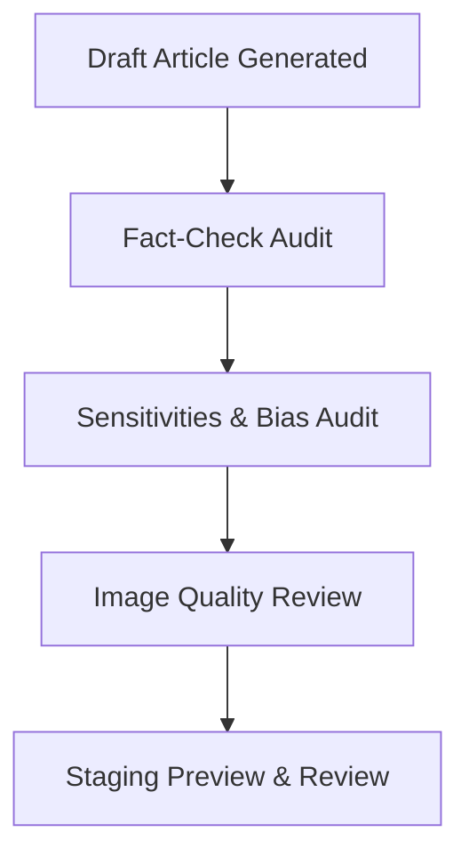

# Editorial Quality, Feedback, and Auditing Policy

This document outlines the operational guidelines and backend pipeline logic for article feedback, revision requests, and automated compliance audits in the Newsroom Lab system.

---

## 1. The Interactive Feedback & Revision Loop

The Newsroom Lab relies on a collaborative cooperative model between human editors and autonomous AI journalists. When articles are generated, they transition to `awaiting_admin_review` and are queued for verification.

### 1.1 Revision Requests and Instructions
If a draft contains factual inaccuracies (e.g., incorrect match scores, outdated rosters, or speculative claims) or does not meet brand style guidelines:
- Editors can select **Revision** from the Telegram Simulator or the Admin Dashboard.
- A free-form comment text field is provided to enter specific revision instructions (e.g., *"Correction: South Africa won the match 2-1 yesterday; Benni McCarthy is retired and did not play"*).
- The feedback comment is persisted in the database under the `admin_feedback` table.

### 1.2 Automated Context Injection
Upon triggering a resubmission/regeneration:
- The pipeline queries the most recent revision feedback for the article.
- **Research Phase Adjustment**: The feedback is injected as a high-priority search parameter during the research phase, forcing the model to verify and align facts with the editor's corrections.
- **Drafting & Editing Adjustment**: The feedback is injected directly into the writing prompt, guiding the outline, draft, and final editorial content to directly address the corrections.

---

## 2. Automated Quality Compliance Audits

Every generated draft goes through a multi-layer staging audit before it reaches the editor's queue. 

### 2.1 Fact-Check Audit
Cross-references the generated article draft against the gathered research notes.
- **Verified Claims**: Factual statements that align directly with the verified research sources.
- **Weak/Speculative Claims**: Statements that are not supported by the research notes or show high risk of hallucination.
- **Factual Integrity Score**: A percentage score (from 0 to 100). Scores below 80 flag the article as `needs_review` or `failed`.

### 2.2 Sensitivities & Bias Audit
Audits style guidelines compliance and ensures demographic and equity representation.
- **Demographics & Equity**: Verifies that representation is respectful, diverse, and dignified.
- **Style & Tone**: Ensures the draft adheres to the individual journalist's rules, tone (e.g., warm, sensory-driven, or enthusiastic), and beat.
- **Compliance Level**: Evaluated as `High`, `Medium`, or `Low`. Anything below `High` prompts specific PD recommendations for tone correction.

### 2.3 Image Quality Review
Audits generated featured graphics or visual prompts against the photography/creative briefs.
- **Relevance & Aesthetics**: Rates the image direction out of 5 stars based on style matching (e.g., South African morning light, authentic details).
- **Anatomy & Composition**: Verifies that the prompt directions contain no glaring composition errors.

---

## 3. Presentation Standards

To ensure editorial efficiency, audit reports must never display as raw data payloads or serialized strings. The dashboard parses the audit JSON structures to render:
1. **Interactive Metrics**: Percentage badges, star ratings, and colored compliance labels.
2. **Visual Lists**: Tabular side-by-side grids for verified vs. speculative claims.
3. **Actionable Suggestions**: Custom editorial notes and recommendation boxes for resubmission guidelines.
