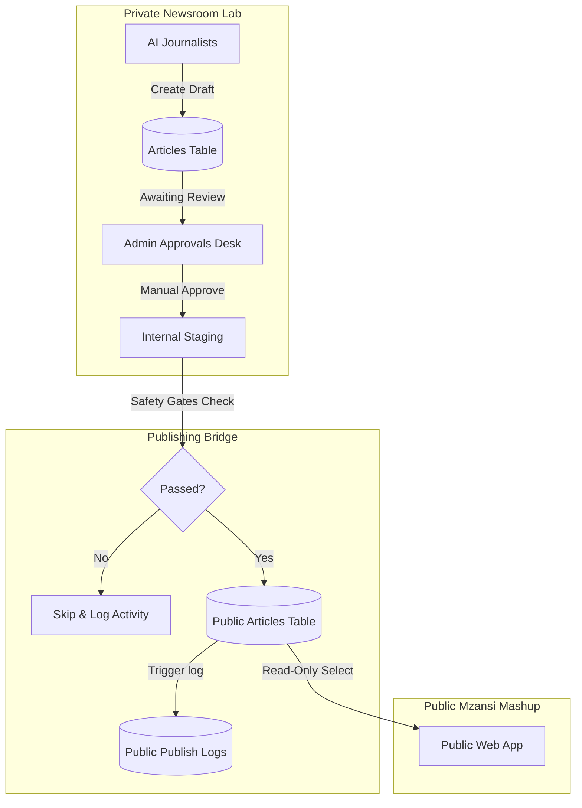

# Mzansi Mashup Live Beta: Publishing Bridge Integration Guide

This guide details the architecture, safety gates, database tables, and code consumption patterns introduced in **Phase 2B: Mzansi Mashup Live Beta Publishing Bridge**.

---

## 1. Architectural Boundary & Data Flow

To ensure high journalistic standards and system isolation during the live beta, a strict separation is maintained between the **Private Newsroom Lab** and the **Public Mzansi Mashup Site**.



### Critical Rules
1. **Isolated Reading**: The public Mzansi Mashup website **must never** query the private `articles` or `journalists` tables directly. It is restricted to reading from `public_articles`.
2. **Read-Only Database Access**: Public visitors browse articles via Supabase Row-Level Security (RLS) configured to allow only `SELECT` operations on `public_status = 'published'` articles.
3. **No Direct Mutate**: Public-facing code has no write access to any database tables. All updates/unpublishing are triggered by authenticated admin operations via secure Netlify functions.

---

## 2. Database Schema

The publishing bridge relies on two public-facing tables:

### `public_articles`
Holds public versions of approved sandbox articles. Only articles with `public_status = 'published'` are visible to anonymous users.
- `id` (uuid, primary key): Auto-generated unique identifier.
- `article_id` (uuid, references `articles` on cascade delete): Link to the private article source.
- `journalist_id` (text, references `journalists` on restrict delete): The authoring journalist.
- `website` (text, default `'mzansimashup.co.za'`): Branding verification.
- `title` (text): Public article title.
- `slug` (text, unique): URL-friendly string generated from the title.
- `summary` (text, nullable): Brief description.
- `body` (text): Full markdown or HTML article content.
- `featured_image` (text, nullable): Public CDN URL of the approved featured image.
- `category` (text): Mapped category (`lifestyle`, `sports`, `entertainment`, `technology`, `business`).
- `tags` (text[]): Tag array.
- `public_status` (text, check constraint): `'draft'`, `'published'`, or `'unpublished'`.
- `published_at` (timestamptz, nullable): Date & time the article went live.
- `unpublished_at` (timestamptz, nullable): Date & time the article was withdrawn.
- `created_at` / `updated_at`: Metadata timestamps.

### `public_publish_logs`
Chronicles all manual and automated bridge actions for auditability and system monitoring.
- `id` (uuid, primary key)
- `article_id` (uuid, references `articles` on cascade delete)
- `public_article_id` (uuid, references `public_articles` on set null)
- `journalist_id` (text, references `journalists` on set null)
- `action` (text): `'auto_publish'`, `'manual_publish'`, `'manual_unpublish'`.
- `status` (text): `'success'`, `'failed'`, `'skipped'`.
- `reason` (text, nullable): Detailed explanation of failure or skip.
- `metadata` (jsonb): Raw audit parameters (e.g. scores, status details).
- `created_at` (timestamptz)

---

## 3. Safety Gates (Eligibility Rules)

Before any article is inserted or updated in `public_articles`, the publishing bridge enforces three validation gates:

| Gate | Requirement | Description |
|---|---|---|
| **Risk Level Check** | `risk_level !== 'high'` | Block high-risk content. Only low and medium-risk content may proceed. |
| **Fact-Check Pass** | `fact_check_status === 'passed'` | Block any drafts with unverified claims (`needs_review` or `failed`). |
| **Bias-Check Pass** | `bias_check_status === 'passed'` | Block biased, non-neutral drafting. |

If any check fails, the bridge halts and writes a `skipped` log detailing the exact cause, ensuring that unvetted drafts never breach public staging.

---

## 4. How the Public Site Consumes Data

The public Mzansi Mashup website (built with Next.js) consumes data from `public_articles` using the following patterns:

### A. Initializing read-only Supabase Client
Use the Supabase public anon key to connect from the public site.
```typescript
import { createClient } from '@supabase/supabase-js';

const supabaseUrl = process.env.NEXT_PUBLIC_SUPABASE_URL!;
const supabaseAnonKey = process.env.NEXT_PUBLIC_SUPABASE_ANON_KEY!;

export const supabase = createClient(supabaseUrl, supabaseAnonKey);
```

### B. Fetching Published Articles List (e.g., in a Home/Feed page)
```typescript
export async function getLiveArticles() {
  const { data, error } = await supabase
    .from('public_articles')
    .select('id, title, slug, summary, category, featured_image, published_at')
    .eq('public_status', 'published')
    .order('published_at', { ascending: false });

  if (error) {
    console.error('Error fetching public articles:', error);
    return [];
  }
  return data;
}
```

### C. Category Mapping
When publishing, private sections are mapped to standardized categories:
- `Food & Weekend Markets` / `Family & Kids Days Out` &rarr; `lifestyle`
- `Sports & Outdoor Adventure` &rarr; `sports`
- `Local Music & Gigs` &rarr; `entertainment`
- `Tech & Startups` &rarr; `technology`
- `Business & Finance` &rarr; `business`

On the public site, you can filter by category using a simple select clause:
```typescript
const { data } = await supabase
  .from('public_articles')
  .select('*')
  .eq('public_status', 'published')
  .eq('category', 'lifestyle');
```

### D. Rendering Article Pages by Slug (Dynamic Routing)
Configure a dynamic route like `app/posts/[slug]/page.tsx` on the public site:
```typescript
interface PostProps {
  params: { slug: string };
}

export default async function PostPage({ params }: PostProps) {
  const { data: post, error } = await supabase
    .from('public_articles')
    .select('*')
    .eq('slug', params.slug)
    .eq('public_status', 'published')
    .maybeSingle();

  if (error || !post) {
    return <div>Article not found</div>;
  }

  return (
    <article className="max-w-3xl mx-auto py-10 px-4">
      {post.featured_image && (
        
      )}
      <div className="flex gap-2 mb-4">
        <span className="bg-orange-100 text-orange-700 px-3 py-1 rounded-full text-xs font-mono">
          {post.category}
        </span>
      </div>
      <h1 className="text-4xl font-serif font-bold mb-4">{post.title}</h1>
      <p className="text-sm text-gray-500 font-mono mb-6">
        Published: {new Date(post.published_at).toLocaleDateString()}
      </p>
      <div className="prose lg:prose-xl max-w-none">
        {post.body}
      </div>
    </article>
  );
}
```

---

## 5. Live Beta Environment Flags

- **`MZANSI_AUTO_PUBLISH_ENABLED`**:
  - `true`: When an administrator manually approves a sandbox article via the Approvals Desk, if it passes the safety gates, it is automatically bridged and published to `public_articles`.
  - `false` (default for controlled beta): Articles stay in `approved_sandbox` upon approval. The administrator must go to the **Mzansi Live Beta** tab and manually click **Publish to Mzansi** to bridge them.
- **`MZANSI_PUBLIC_BASE_URL`**: Used for generating shareable preview links or triggering ISR (Incremental Static Regeneration) revalidation hooks on the public site upon publish events.
